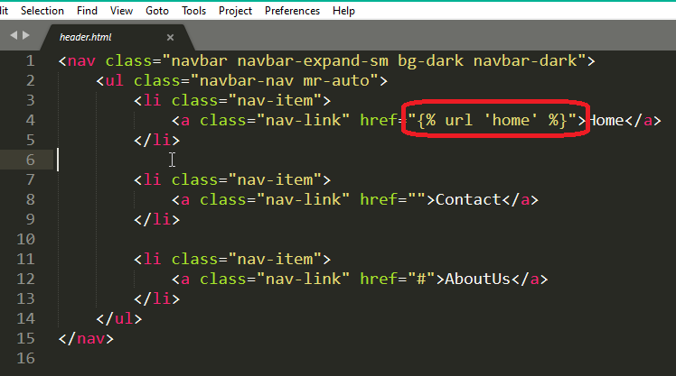
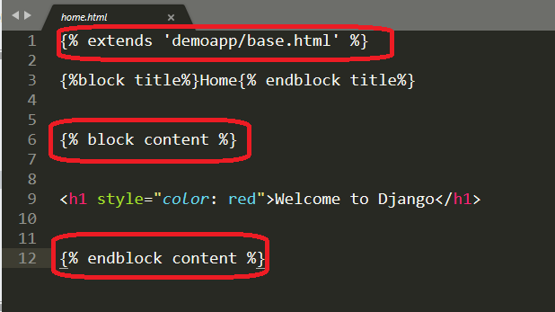

# Django template language(D.T.L)

* This document explains the language syntax of the Django template system.
* Django’s template language is designed to strike a balance between power and ease.
* It’s designed to feel comfortable to those used to working with HTML.


**A template consists of static parts of the desired HTML output as well as some special syntax describing how dynamic content will be inserted.**

## Why Django Template?

* In HTML file, we can't write python code because the code is only interpreted by python interpreter not the browser. We know that HTML is a static markup language, while Python is a dynamic programming language.

* Django template engine is used to separate the design from the python code and allows us to build dynamic web pages.

## Django Template Configuration

**To configure the template system, we have to provide some entries in ```settings.py file```.**

````
TEMPLATES = [
    {
        'BACKEND': 'django.template.backends.django.DjangoTemplates',
        'DIRS': [],
        'APP_DIRS': True,
        'OPTIONS': {
            'context_processors': [
                'django.template.context_processors.debug',
                'django.template.context_processors.request',
                'django.contrib.auth.context_processors.auth',
                'django.contrib.messages.context_processors.messages',
            ],
        },
    },
]
````

**Here, we mentioned that our template directory name is templates. By default, DjangoTemplates looks for a templates subdirectory in each of the INSTALLED_APPS.**

## Django Template Simple Example

* First, create a directory Django App inside ```templates folder```,```appfolder```,  inside the project app as we did below

````
templates/appnanme/base.html

````
**Inside base.html apply with Code**


____

**before create header.html template** 

**here inside base.html we can load with include – Django Template Tags Syntax is `````` **

```
   
   
```

## include – Django Template Tags

* Django templates not only allow passing data from view to template, but also provides some limited features of programming such as ````variables````, ````for loops````, ````comments````, ````extends````, ````include````,````if````,````endif````,````else````.

## how to use include tag in Templates

* ```include tag``` **loads a template and renders it with the current context**. This is a way of “including” other templates within a template. The template name can either be a variable or a hard-coded (quoted) string, in either single or double quotes.


### include with header.html


____

**After that create a template header.html inside the ``templates/appname/filename.html``.

**create header.html template**

* Inside header.html apply code [navbar](https://www.w3schools.com/bootstrap4/bootstrap_navbar.asp)



## extends – Django Template Tags

* Django templates not only allow passing data from view to template, but also provides some limited features of programming such as ````variables````, ````for loops````, ````comments````, ````extends````, ````include````,````if````,````endif````,````else````.


## how to use extends tag in Templates

* ``extends tag`` in Templates. extends tag is used for inheritance of templates in django. One needs to repeat the same code again and again. Using extends we can inherit templates as well as variables.

**Syntax**

``

``

**create home.html template**




