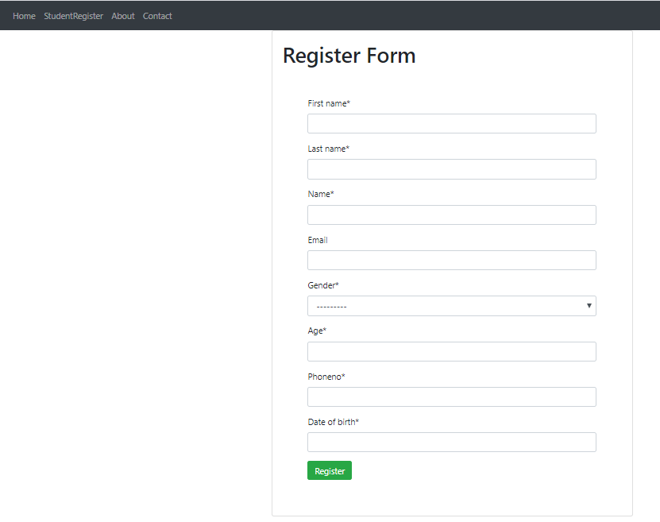
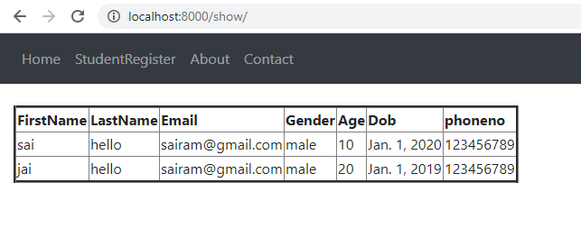

# Django-Crispy-Forms
* you will build a simple example Django application with a form styled with Bootstrap


# What is Django-Crispy-Forms

* By using django-crispy-forms, a popular package that makes it easy for Django developers to create beautiful forms easily and without re-inventing the wheel.

* you'll also be using Bootstrap 4—the latest version of the most popular CSS and HTML framework for building HTML interfaces—to style the form.

* The django-crispy-forms enables you to quickly add and render Bootstrap 4 styled forms with a few lines of code.

## Prerequisites

* A recent version of Python 3 (3.6 is the latest),
+ A basic knowledge of Python,
- A working knowledge of Django.

````
django-crispy-forms supports Django 2.2 and 3.0 with Python 3.5+.
```

## Creating a Django Project & Application

* After installing Django, you need to create a project  using django

### Project Create


````
django-admin startproject demoproject
````

* Next, create an application using manage.py, you can name it accounts

### App Create

````
cd demoproject
````

````
django-admin startapp student
````
     (or)

````
python manage.py startapp student
````

#### Next, you need to add accounts in the INSTALLED_APPS array inside the settings.py file of your project.

```
Installing & Setting up django-crispy-forms
````


------------------------------------------

* Before adding anything else, let's install the django-crispy-forms application by using pip:

````
pip install django-crispy-forms
````


+ Next, as always, you need to add django-crispy-forms into the INSTALLED_APPS array in the setting.py file

--------------------------------------------
```
INSTALLED_APPS = 
[

    'student',(appname)
    
    'crispy_forms',
    
         ]
````

### Since django-crispy-forms supports multiple styles, you also need to specify the CSS framework you want to use in your forms.

* You can do that by using the **CRISPY_TEMPLATE_PACK**  setting in the settings.py file


```
CRISPY_TEMPLATE_PACK = 'bootstrap4'
```

* That's all what you need for installing and setting up django-crispy-forms.

____

# Adding Bootstrap 4 to your Project

**Installing the django-crispy-forms application, doesn't add Bootstrap 4 to your Django project.**

Adding Bootstrap 4 is quite easy, you can either head over to its official website at [getbootstrap.com](https://getbootstrap.com/) and download the files in your project's folder or you can also use Bootstrap 4 from a CDN. See the [docs](https://getbootstrap.com/docs/4.0/getting-started/introduction/) for more information

____

**Create a templates/accounts/base.html template inside the accounts application and add the following code**

**You can also add the JavaScript file for Bootstrap 4 if you intend to use the features that require JavaScript**

***We use the container, row, col-x and justify-content-center classes to create a simple layout with a one row and one column.***

```

<!doctype html>
<html lang="en">
  <head>
    <link rel="stylesheet" type="text/css" href="">
     <link rel="stylesheet" type="text/css" href="">
     <link rel="stylesheet" type="text/css" href="">
    <title>Django Form Example with Bootstrap 4</title>
  </head>
  <body>
    <div class="container d-flex h-100">
      <div class="row justify-content-center">
        <div class="col-10">
          <h1> Django Form Example with Bootstrap 4 </h1>
          
          
        </div>
      </div>
    </div>
  </body>
</html>
````


# Creating the User Model(s)

**Let's now create a User model. Open the student/models.py file and add the following code**

```
from django.db import models

class Register(models.Model):
    gender=(('male','Male'),('female','Female'))
    first_name=CharField(max_length=50)
    last_name=CharField(max_length=50)
    name = models.CharField(max_length=100)
    email = models.EmailField(blank=True)
    gender=models.CharField(max_length=10,choices=gender)
    age=models.IntegerField(null=True)
    phoneno=models.CharField(max_length=12)
    date-of-birth=models.IntegerField(null=True)
```
___

**Next,create student/forms.py in your App**

```
from django.forms import ModelForm

from student.models import  Register

class RegisterForm(ModelForm):
	class Meta():

		model=Register

		fields='__all__'  # few fields['first_name','last_name','age','pincode']

		# fields=['first_name','last_name','age','pincode']

```
____

**Next,create student/views.py in your App**

```
from django.shortcuts import render,redirect

from django.http import HttpResponse

from student.forms import RegisterForm   # or *  

from.models import Register 

def register(request):
	form=RegisterForm()   # generate html form
	return render(request,'accounts/register.html',{'form':form})
```
____

**If you don't specify the template name, Django will assume you are using a student/filename.html template**

***Next, create an templates/student/register.html template inside the accounts application that extends the base.html template and add the following code***

```

Register



  <form action="" method="post">
  
    
    
    {{ form|crispy }}
    
       <div class="text-center">
   	  <input type="submit" class="btn btn-success  btn-lg" value="Register">
   	  <input type="reset" class="btn btn-warning  btn-lg"value="Cancel">
       </div>
  </form>


```
___

**To be able to see our register page, we need to add a register URL. Open the urls.py file and add**

````
from django.contrib import admin
from django.urls import path
from student import views

urlpatterns = [
    path('admin/', admin.site.urls),
    path("",views.index,name="index"),
    path('register/',views.register,name="register"),
    path('show/'views.show,name="show")
]

````
___

**At this point, this is how our Register page looks like**

# Django Form Example with Bootstrap 4


<a href="https://drive.google.com/file/d/1HCiwoUnzBLOIJeo1tK12oNm8i_Ndye5_/view?usp=sharing" height="900" width="900">ClickHere</a>

____

# Insreting Values

 **Next accounts in views.py in your App**
 + send values to form by using **POST Method**
 
 ```
 def register(request):
	if request.method=="POST":
		form=StudentForm(request.POST)
		if form.is_valid():
			form.save()
			return redirect('show')
	form=StudentForm()
	return render(request,'student/register.html',{'form':form})
````

____

# Read the data in Table Format

````


Show

<div class="container-fluid pt-4">
<table border="3">
	<tr>
		<th>FirstName</th>
		<th>LastName</th>
		<th>Email</th>
		<th>Gender</th>
		<th>Age</th>
		<th>Dob</th>
		<th>phoneno</th>
	</tr>

	<tbody>
		<tr>
			<td>{{data.first_name}}</td>
			<td>{{data.last_name}}</td>
			<td>{{data.email}}</td>
			<td>{{data.gender}}</td>
			<td>{{data.age}}</td>
			<td>{{data.date_of_birth}}</td>
			<td>{{data.phoneno}}</td>
		</tr>
		
	</tbody>
</table>
</div>

````
____

**At this point, this is how to display page looks like**


<a href="https://drive.google.com/open?id=1VfAVNK1abB-97n2GoXwLYnhSekILoszL"height="900" width="900">ClickHere</a>


